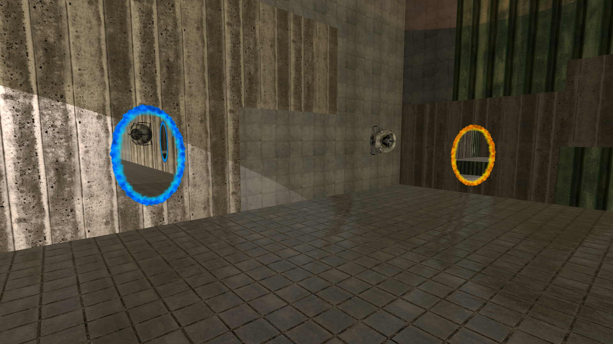
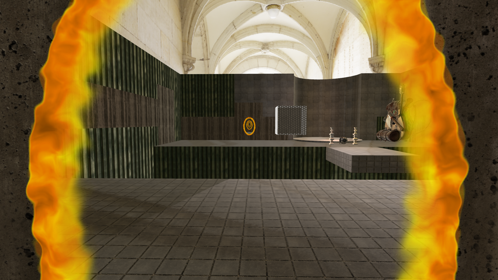

# Aperture Laboratories Test Room

## Description

This game serves mainly as an implementation exercise to make a clone of Aperture laboratories' test room. In this room it is possible to put two different portals on the portal-conducting material, i.e. concrete walls.

A blue and orange paired portal that is interconnected. Through the portal it is possible to view the test room or walk through them.

The application is built on a simple custom OpenGL engine that provides a framework for working with OpenGL itself for easier manipulation.

---

## Controls

- `W`,`S`,`A`,`D` - scene traversal
- `Shift`+`W`,`S`,`A`,`D` - sprint
- `Spacebar` - Infinite jumping
- `LMB Click` - place blue portal on a concrete wall
- `RMB Click` - place orange portal on a concrete wall
- `F` - toggle fog
- `M` - mount camera to an object
- `ESC` - toggle in-game menu
- `V` - switch static camera to movable state
- `F1` - switch to static camera 1
- `F2` - switch to static camera 2
- `F3` - mount camera to the levitating robot (Wheatley)
- `F4` - plays the camera movement along a predefined curve 
- `F5` - Reset free camera to default position
- `F6` - Return to the free camera view from the other cameras

---

## Building

Built with `MSVC v142` (14.29) and `Windows 10 SDK` (10.0.19041.0) in VS 2019. 

With the help of these, the school's `PGR library` was rebuilt, which includes the `assimp`, `DevIL` and `freeglut` libraries. If the application could not be built using the newer build tools and Windows SDK it is because of this PGR library.

The repository contains the current build of this application in the root directory. 

---

## Implemented features
The OpenGL engine enables this application:

- Load OBJ 3D model files with defined materials
- Phong illumination model per pixel
- Use of 6 different texture types for rendering model material
  - Diffuse, Specular, Normal, Roughness, Ambient Occlusion and Opacity
- Normal mapping
- 3 light casters
  - Directional, Spotlight, Point light
- Skybox relative to the camera
  - used also for texture illumination for objects in the scene
- Jumping with freefall equation
- Floor collistion with Möller–Trumbore intersection algorithm
- Stencil buffer operations
- Dynamic moving textures
- Definition of parametric Catmull-Rom curves
- Camera mounting to objects
- Exponential fog
- Simplistic menu with UV texture cursor navigation